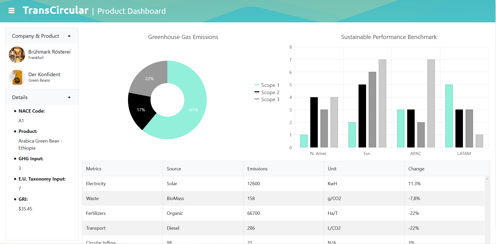

# climate-founders-climate-hack
## About
This is a submission for the Feb 2021 Climate Hack by Climate Founders. The code is part of the TransCircular project. TransCircular is a German company which conducts ESG analytics for SMEs. The dashboard provides sustainability information on a company or product for consumers. The example used here is with local coffee roasters. TransCircular intends to add blockchain infrastructure to ensure tracability along the entire value chain in the future and have this dashboard autogenerated from the data collected there. Our MVP displays data on greenhouse gas emmision (scope 1-3) for a coffee product.

## Built With
* React
* Typescript
* Apollo GraphQL
* SQLite  

## Links
Website: https://www.transcircular.com/                                            
Pitchdeck: https://drive.google.com/file/d/1A6k4MdbYUtRIzLfsAVt920Ki3KjFZNQj/view?usp=sharing  

## Contributors

#### [@ricotomo](https://github.com/ricotomo) - frontend 
#### [@adamjsawicki](https://github.com/adamjsawicki) - backend

